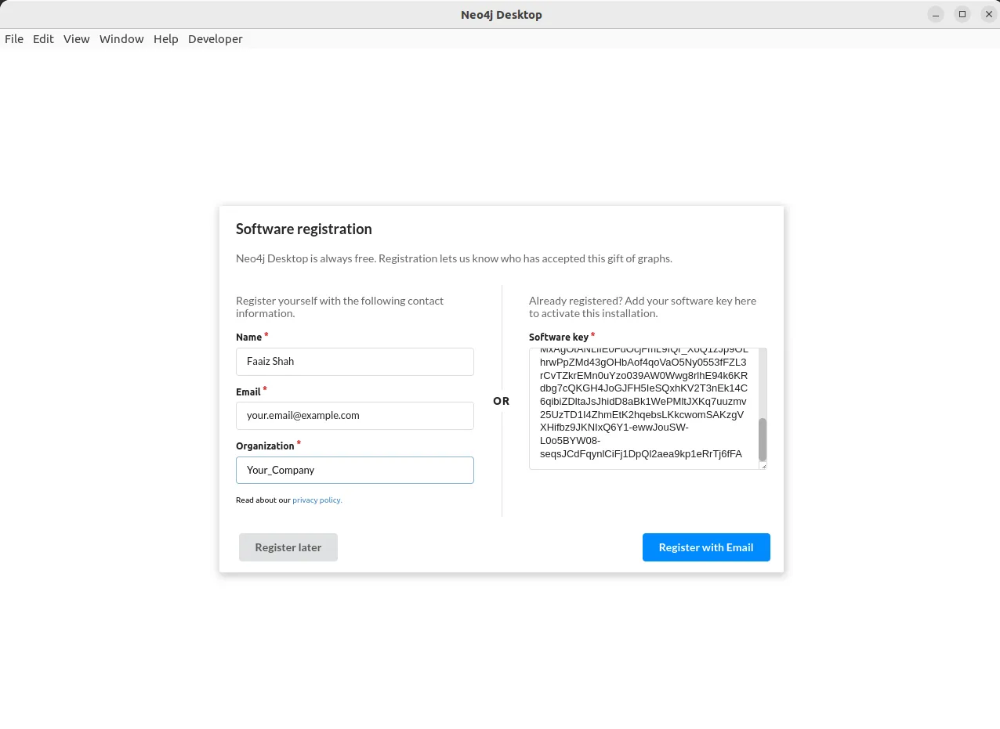
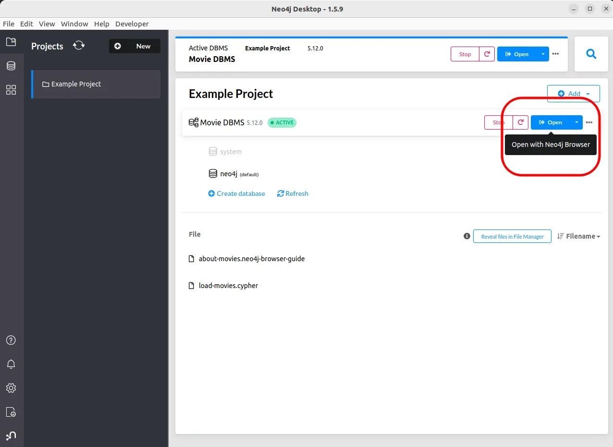

# Installation of “Neo4j Desktop” on Ubuntu 

## 1. Installing Neo4j Desktop

Visit on the Neo4j download website https://neo4j.com/download/


When you click on the Download button, you will get a screen to register yourself to receive the activation key for Neo4j Desktop as below:


When you click on the download button, a new screen will appear that will contain the key as shown below and the downloading will start.


Copy and keep the `Activation Key` at a safe location that we will use for software registration step.

Go the directory where installation file `.AppImage` is downloaded, and execute the following command

```bash
chmod +x neo4j-desktop-1.5.9-x86_64.AppImage
```


```bash
./neo4j-desktop-1.5.9-x86_64.AppImage  
```

If you get the error like below:

```bash
dlopen(): error loading libfuse.so.2

AppImages require FUSE to run. 
You might still be able to extract the contents of this AppImage 
if you run it with the --appimage-extract option. 
See https://github.com/AppImage/AppImageKit/wiki/FUSE 
for more information
```
Then run the following commands:
```bash
sudo add-apt-repository universe
sudo apt install libfuse2
```

After that you can execute again the command
```bash
./neo4j-desktop-1.5.9-x86_64.AppImage
```

And you will see the output similar to following:

```bash
[14:50:00.780] [info]  ● ● ● Starting Neo4j Desktop 1.5.9 @ Linux 6.2.0-35-generic, Intel(R) Core(TM) i7-9750H CPU @ 2.60GHz}
libva error: vaGetDriverNameByIndex() failed with unknown libva error, driver_name = (null)
[Nest] 636834  - 11/07/2023, 2:50:01 PM     LOG [NestFactory] Starting Nest application...
[Nest] 636834  - 11/07/2023, 2:50:01 PM     LOG [InstanceLoader] DeprecatedGraphQLModule dependencies initialized +75ms
[Nest] 636834  - 11/07/2023, 2:50:01 PM     LOG [InstanceLoader] GraphQLSchemaBuilderModule dependencies initialized +0ms
[Nest] 636834  - 11/07/2023, 2:50:01 PM     LOG [InstanceLoader] GraphQLModule dependencies initialized +1ms
[14:50:01.247] [info]  Initializing persistence
[Nest] 636834  - 11/07/2023, 2:50:01 PM     LOG [GraphQLModule] Mapped {/graphql, POST} route +87ms
[Nest] 636834  - 11/07/2023, 2:50:01 PM     LOG [NestApplication] Nest application successfully started +1ms
[14:50:01.333] [info]  ● ● ● GraphQL server is running @ http://127.0.0.1:11001
[14:50:01.341] [info]  Creating persistent store - projects
[14:50:01.360] [info]  Creating persistent store - databases
[14:50:01.363] [info]  Creating persistent store - userData
[14:50:01.369] [info]  Creating persistent store - graphApps
[14:50:01.372] [info]  Creating persistent store - plugins
[14:50:01.376] [info]  Creating persistent store - distributions
```
And a window Neo4j Desktop with license agreement will appear as follows:


Next is the Software registration page. Here you need to enter the activation key that you received at the time of software download.




After successful registration, you will see the installation screen as below:


After the successful installation you will see a message as below. Click Ok


And, finally you have Neo4j Desktop screen 😊


To open the example project Movie DBMS click on the Open button as shown in the picture below:




Et Voilà! 

You have a working Neo4j graph database up and working with an example database.


---


---
You may also visit url: 
<br>
https://medium.com/@faaizhussain/installation-of-neo4j-desktop-on-ubuntu-22-04-3d2ea872c5e5


