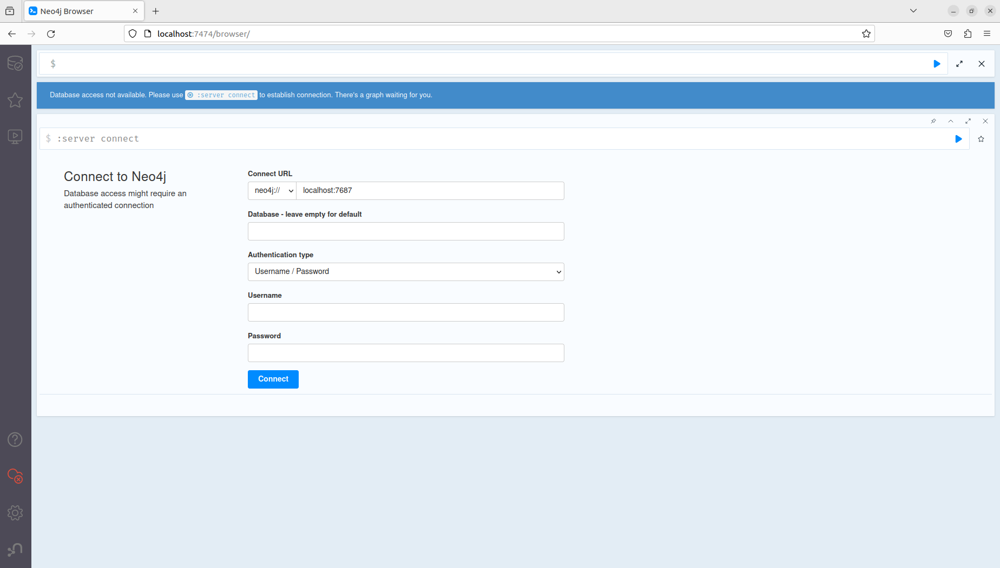
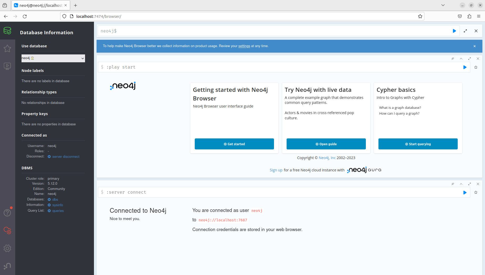
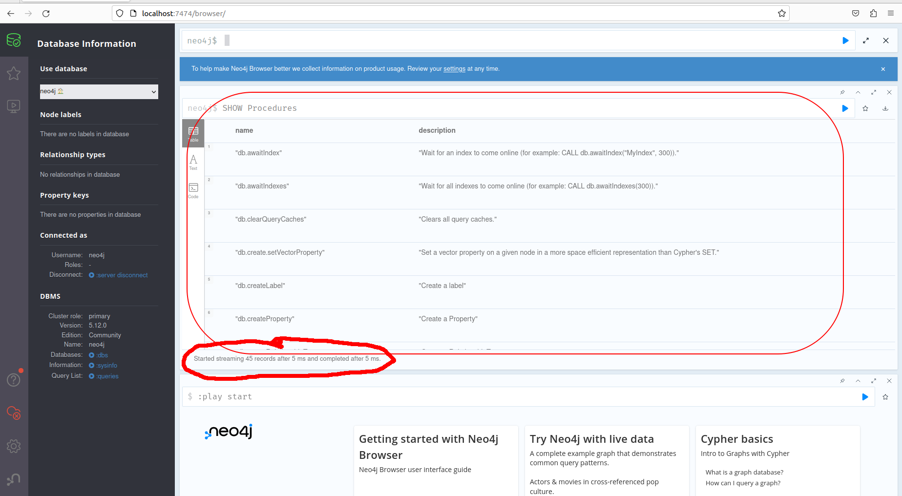
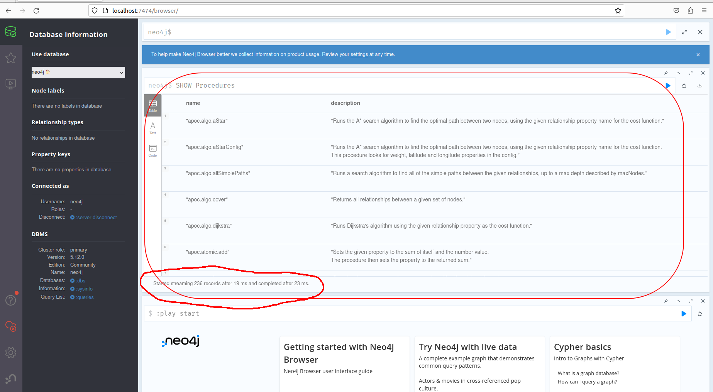
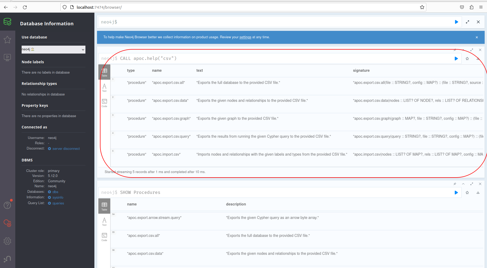

# Installation using docker-compose

## 1. Installation

1. First we get the user id (UID) and group id (GID) of the current user through which we are logged in.

    ```zsh
    id - u && id -g
    ```

    output would be like:

    ```zsh
    1000
    1000
    ```

2. Create a directory e.g., `Neo4jDocker`

   ```zsh
   mkdir Neo4jDocker
   ```

   Now, create following directories inside the directory `Neo4jDocker`

   ```zsh
   mkdir {conf, data, import, logs, plugins }
   ```

3. Create a `.env` file inside the directory `Neo4jDocker` and where have `docker-compose` file.The contents of the files will be:

   ```bash
   HOST_UID=1000
   HOST_GID=1000
   NEO4J_PASSWORD=mysecretpassword
   
   ```
  
4. create a file `neo4j-docker-compose` inside the directory  `Neo4jDocker`. The contents of the are as given below:

    ```zsh
    version: "3"
    services:
      neo4j:
        container_name: Neo4j-test
        image: neo4j:5.12.0
        user: "${HOST_UID}:${HOST_GID}"
        volumes:
          - ./data:/data
          - ./plugins:/plugins
          - ./import:/import
          - ./logs:/var/lib/neo4j/logs 
          - ./conf:/var/lib/neo4j/conf
        ports:
          - "7474:7474"
          - "7687:7687"
        environment:
          - NEO4J_apoc_export_file_enabled=true
          - NEO4J_apoc_import_file_enabled=true
          - NEO4J_dbms_security_procedures_unrestricted=apoc.*,algo.*
          - NEO4J_server_memory_heap_initial__size=512m
          - NEO4J_server_memory_heap_max__size=2G
          - NEO4J_apoc_uuid_enabled=true
          - NEO4J_server_default__listen__address=0.0.0.0
          - NEO4J_initial_dbms_default__database=neo4j
          - NEO4J_AUTH=neo4j/${NEO4J_PASSWORD}
        networks: ["Neo4j-test"]
        restart: unless-stopped
    networks: { Neo4j-test: {} }
    # use docker volume to persist data outside of a container.
    volumes:
      Neo4j-test:
    ```

5. Verify that you have the right directory structure by running the command:

   ```zsh
   tree -a .
   ```

    Output should be following:

    ```zsh
    .
    ├── conf
    ├── data
    ├── .env
    ├── import
    ├── logs
    ├── noe4j-docker-compose
    └── plugins

    5 directories, 2 files
    ```

    Note: If you do not have `tree` installed you may install it by executing `sudo apt install tree`.

   Once everything in place, we will execute the following commnad:
   ```zsh
   Neo4jdocker docker-compose -f  noe4j-docker-compose up
   ```
   We will see the output similar to following:
   ```zsh
   [+] Running 1/0
    ✔ Container Neo4j-test  Created                                                                                                                                                                                                0.0s 
    Attaching to Neo4j-test
    Neo4j-test  | Changed password for user 'neo4j'. IMPORTANT: this change will only take effect if performed before the database is started for the first time.
    Neo4j-test  | 2023-11-13 10:31:47.270+0000 INFO  Logging config in use: Embedded default config 'default-user-logs.xml'
    Neo4j-test  | 2023-11-13 10:31:47.275+0000 INFO  Starting...
    Neo4j-test  | 2023-11-13 10:31:47.933+0000 INFO  This instance is ServerId{93e84804} (93e84804-92eb-4361-ad05-742dd98e8a48)
    Neo4j-test  | 2023-11-13 10:31:48.483+0000 INFO  ======== Neo4j 5.12.0 ========
    Neo4j-test  | 2023-11-13 10:31:50.032+0000 INFO  Bolt enabled on 0.0.0.0:7687.
    Neo4j-test  | 2023-11-13 10:31:50.525+0000 INFO  HTTP enabled on 0.0.0.0:7474.
    Neo4j-test  | 2023-11-13 10:31:50.526+0000 INFO  Remote interface available at http://localhost:7474/
    Neo4j-test  | 2023-11-13 10:31:50.528+0000 INFO  id: 372062448A0A9D9D1417299112D4251E8C7D46282DB1ABA3AA9D2BC833D7A3EE
    Neo4j-test  | 2023-11-13 10:31:50.528+0000 INFO  name: system
    Neo4j-test  | 2023-11-13 10:31:50.528+0000 INFO  creationDate: 2023-11-13T10:31:48.947Z
    Neo4j-test  | 2023-11-13 10:31:50.528+0000 INFO  Started.

   ```

  Now, we will go the url `http://localhost:7474/` in the browser and we will see following interface:

  

  Enter the username `neo4j` and the password that you set in `.env` file and connect. You will get the Neo4j Browser interface as shown below:

  

Voila !

## 2. Loading Awesome Procedures On Cypher (APOC) plugins

Before adding of APOC plugin jar, let us see the built-in procedres in database. Let's execute the command in Neo4j browser Cypher prompt as  `SHOW Procedures`. We will get the result:



Now we proceed to load APOC plugin

1. Download the plugins file inside the `plugins` directory of `Neo4jDocker`:

   ```zsh
   wget https://github.com/neo4j/apoc/releases/download/5.12.0/apoc-5.12.0-core.jar
   ```

    You will see the output:

    ```zsh
    Connecting to objects.githubusercontent.com (objects.githubusercontent.com)|185.199.110.133|:443... connected.
    HTTP request sent, awaiting response... 200 OK
    Length: 14547636 (14M) [application/octet-stream]
    Saving to: ‘apoc-5.12.0-core.jar’

    apoc-5.12.0-core.jar                               100%[===============================================================================================================>]  13,87M  12,1MB/s    in 1,1s    

    2023-11-13 11:48:23 (12,1 MB/s) - ‘apoc-5.12.0-core.jar’ saved [14547636/14547636]
    ```

2. Change the permissions of file `apoc-5.12.0-core.jar` and list the directory

   ```zsh
    chmod +x apoc-5.12.0-core.jar && ls -al
    total 14216
    drwxrwxr-x 2 myuser myuser     4096 nov.  13 11:48 .
    drwxrwxr-x 7 myuser myuser     4096 nov.  13 11:02 ..
    -rwxrwxr-x 1 myuser myuser 14547636 sept. 15 09:10 apoc-5.12.0-core.jar

   ```
3. Restart the docker-compose
   ```zsh
   docker-compose -f  noe4j-docker-compose resart
   ```

4. Check again  `SHOW Procedures` in Neo4j browser, and you will see the similar to following output:
   

   To search for a specific APOC, for example procedures about `csv` we can check as with the command `CALL apoc.help("csv")`. We will get the result as shown below:
   