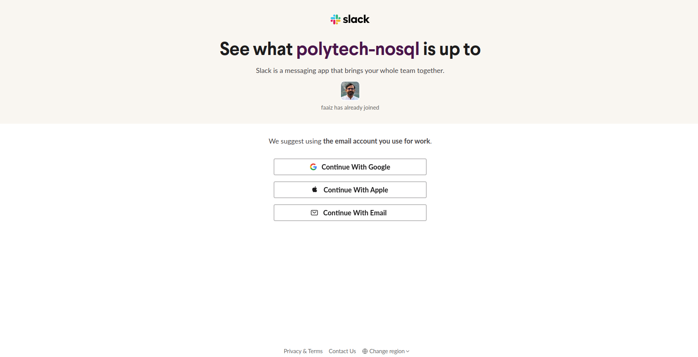
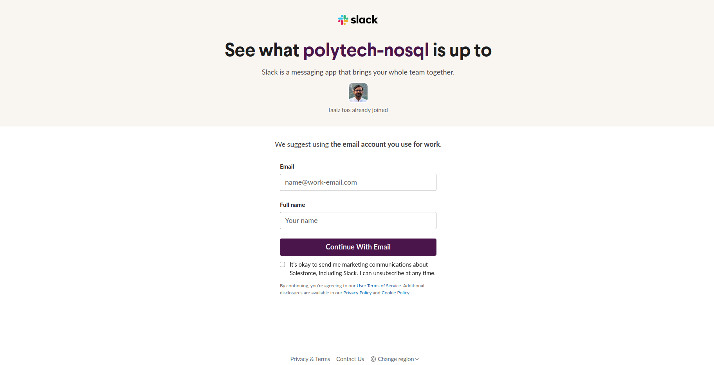
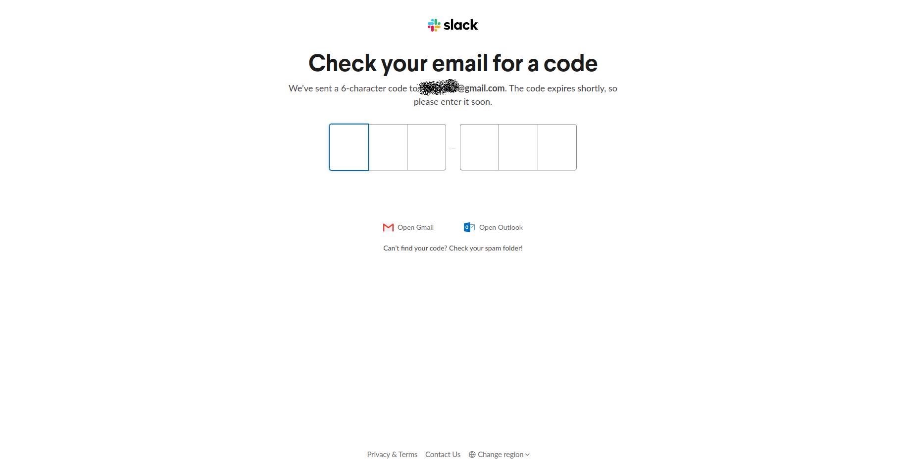
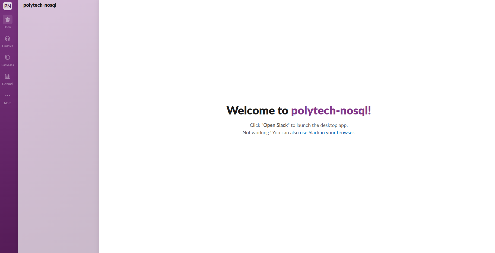
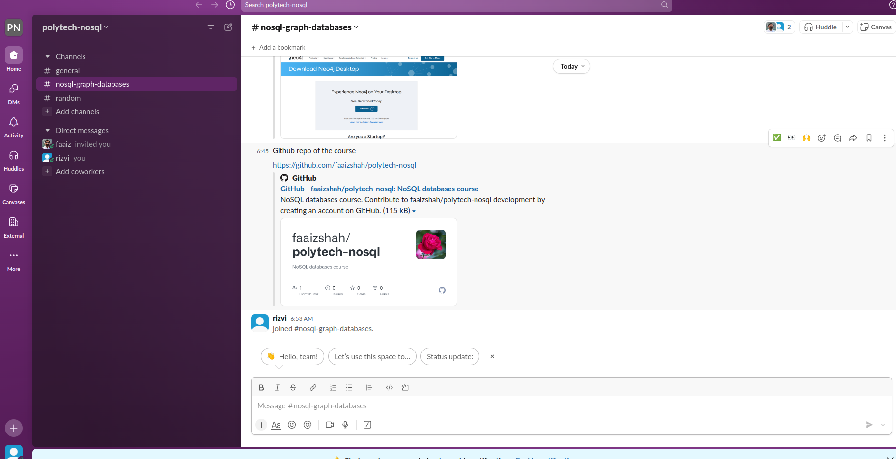

# Slack workspace

We will slack for queries and sharing of thoughts

Click on the below invite link:

https://join.slack.com/t/newworkspace-qiy5086/shared_invite/zt-27j9c2syr-F9STtVA2vVx8xK6_Bz2QIA

You will see the page like this:

Click on `Continue with Email` and yo will see the page:

Enter your email address to join the class workspace. Next you will see the screen for entering the code

You will see the welcome screen.

Then, click on `use Slack in your browser` and you will be in the workspace as shown below:

