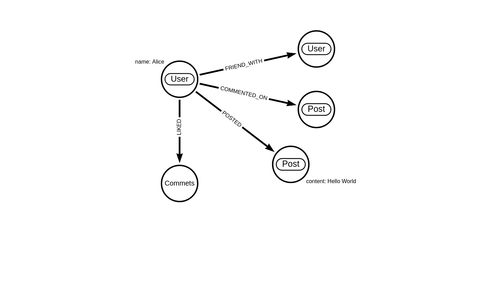

# Social Network Use Case in Neo4j

By implementing and querying this social network model in Neo4j, we can see relationships and their interactions.

**Nodes:**  `Users`, `Posts`, `Comments`.
   
**Relationships:** `FRIEND_WITH` (between Users), `POSTED` (User to Post), `LIKED` (User to Post), `COMMENTED_ON` (User to Post)


Visit https://arrows.app/

## Data Modeling


## Data Insertion

### Create users nodes: 
```sql
CREATE (:User {name: "Alice"}), (:User {name: "Bob"}), (:User {name: "Charlie"}),CREATE (:User {name: "Eve"})
```

#### Create Posts nodes:
```sql
CREATE (:Post {content: "Hello World", id: 1}), (:Post {content: "You are awesome", id: 2})

```
### Create Relationships: 

#### Friendships:

```sql
MATCH (a:User {name: "Alice"}), (b:User {name: "Bob"}) CREATE (a)-[:FRIEND_WITH]->(b)
```

```sql
MATCH (a:User {name: "Alice"}), (c:User {name: "Charlie"}) CREATE (a)-[:FRIEND_WITH]->(c)
```

```sql
MATCH (a:User {name: "Bob"}), (c:User {name: "Eve"}) CREATE (a)-[:FRIEND_WITH]->(c)
```

#### User to Post:
```sql
MATCH (u:User {name: "Alice"}), (p:Post {id: 1}) CREATE (u)-[:POSTED]->(p)
```

#### Likes

```sql
MATCH (u:User {name: "Bob"}), (p:Post {id: 1}) CREATE (u)-[:LIKED]->(p)
```

```sql
MATCH (u:User {name: "Charlie"}), (p:Post {id: 2}) CREATE (u)-[:LIKED]->(p)
```

```sql
MATCH (a:User {name: "Alice"}), (p:Post {id: 1})
CREATE (a)-[:LIKED]->(p)
```

#### Comments

```sql
MATCH (u:User {name: "Bob"}), (p:Post {id: 2}) CREATE (u)-[:COMMENTED_ON {text: "Great post!"}]->(p)
```

## Example Queries to demonstrate the Social Network:

### Finding Friends of a User
```sql
MATCH (u:User {name: "Alice"})-[:FRIEND_WITH]->(friend) RETURN friend.name
```

This retrieves all friends of Alice


### Suggestions for New Friends (Friend of a Friend):

```sql
MATCH (u:User {name: "Alice"})-[:FRIEND_WITH*2..2]->(foaf) WHERE NOT (u)-[:FRIEND_WITH]->(foaf) RETURN DISTINCT foaf.name
```

This query finds friends of Alice's friends who are not directly connected to Alice.

### Finding Common Interests (Users who liked the same Post):

```sql
MATCH (u:User {name: "Alice"})-[:LIKED]->(p:Post)<-[:LIKED]-(other:User) RETURN other.name
```
Finds other users who liked the same posts as Alice

#### Viewing User Interactions on a Post

```sql
MATCH (p:Post {id: 1})<-[:LIKED|COMMENTED_ON|POSTED]-(u:User) RETURN u.name, p.content
```

Shows all users who have liked, commented on, or posted a specific post.

#### Finding Mutual Friends

Suppose you want to find mutual friends between two users, say "Alice" and "Bob." 

```sql
MATCH (alice:User {name: "Alice"})-[:FRIEND_WITH]->(friend)
WITH alice, collect(friend) AS aliceFriends
MATCH (friend)-[:FRIEND_WITH]->(bob:User {name: "Bob"})
WHERE bob IN aliceFriends
RETURN friend.name AS MutualFriend

```

We used the `WITH` keyword to achieve this. `WITH` performs operations that require passing along intermediate results in a query, enabling more complex data manipulations and condition checks within a single query execution.

Explanation:

First `MATCH`: Find all friends of Alice and collect them into a list (using collect(friend)).

```
MATCH (alice:User {name: "Alice"})-[:FRIEND_WITH]->(friend)
```

`WITH`: Pass alice and the list of her friends (aliceFriends) to the next part of the query.

```
WITH alice, collect(friend) AS aliceFriends
```

Second `MATCH`: Find all users who are friends with Bob and also appear in Alice's friends list.

```sql
MATCH (friend)-[:FRIEND_WITH]->(bob:User {name: "Bob"}) WHERE bob IN aliceFriends

```

`RETURN`: Return the names of these mutual friends.
```sql
RETURN friend.name AS MutualFriend
```
