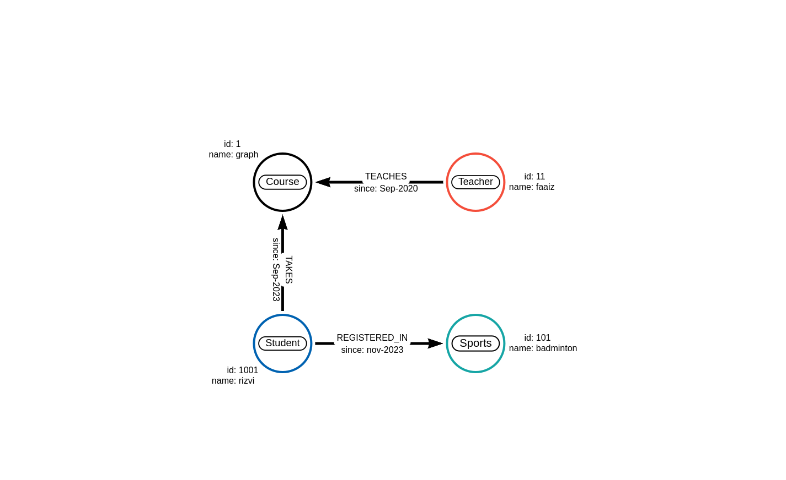

# Student Courses

## Data Modeling 



## Data Insertion

```sql
CREATE (:Sports {id: 101, name: "badminton"})<-[:REGISTERED_IN {since: "nov-2023"}]-(:Student {id: 1001, name: "rizvi"})-[:TAKES {since: "Sep-2023"}]->(:Course {id: 1, name: "graph"})<-[:TEACHES {since: "Sep-2020"}]-(:Teacher {id: 11, name: "faaiz"})
```

## Query Execution