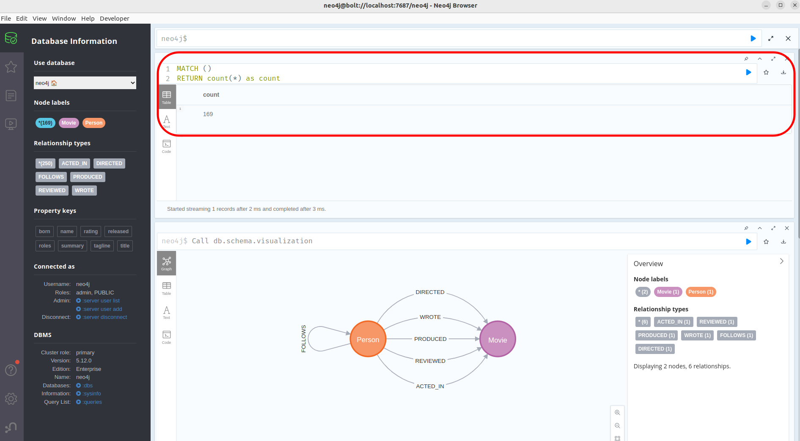
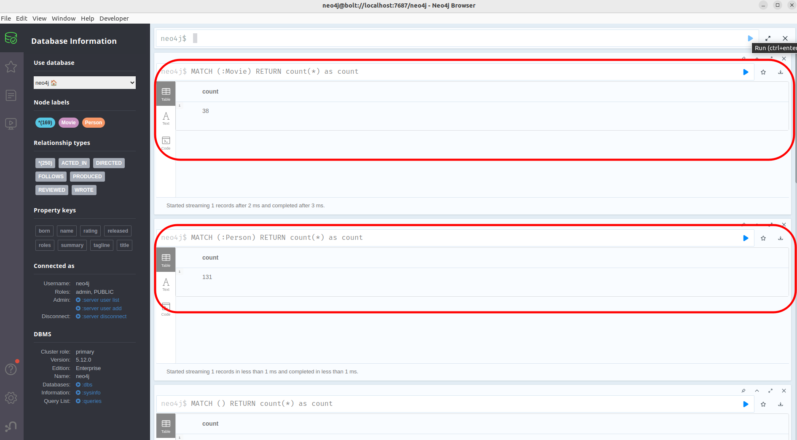
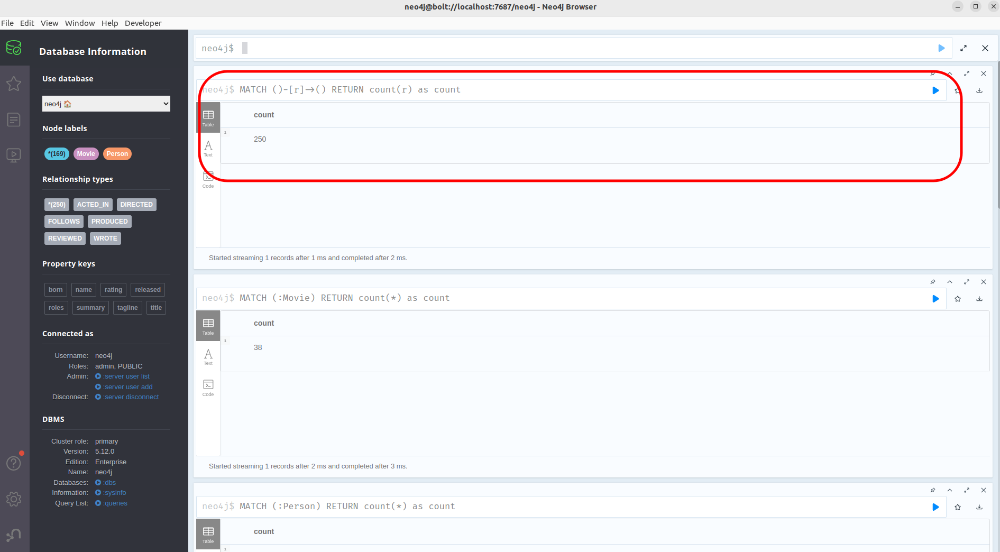
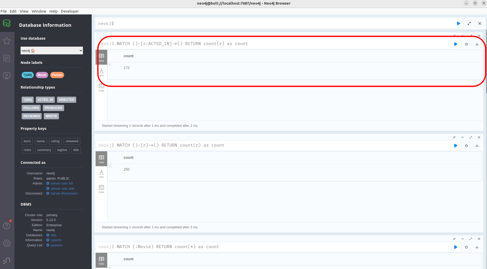
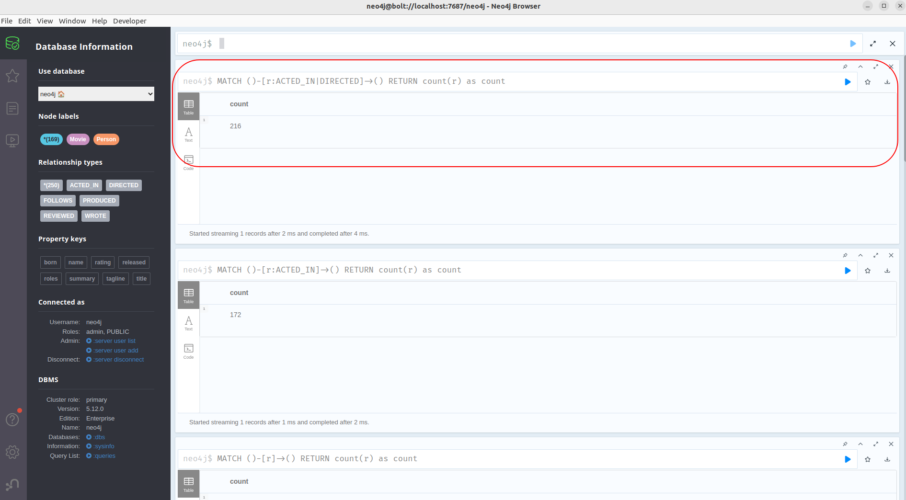
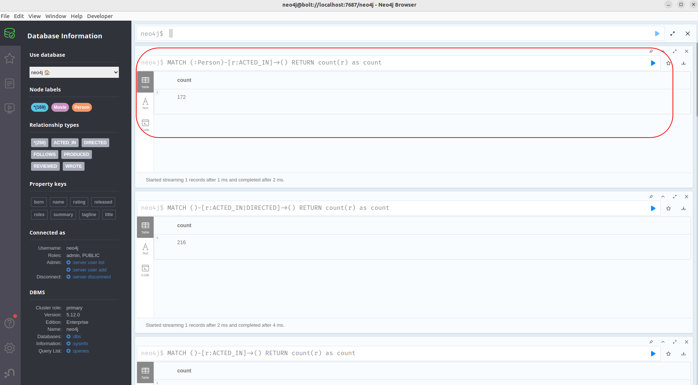

# Using Cypher Queries on Example Graph Database

Click on the left-side top vertical menu icon to see the database information such as `Node labels` and `Relationship types`. You can also see the Property Keys and other DBMS information as shown in the image below.

Let’s execute a few Cypher commands to play with Neo4j graph database. 

1. Display the the graph schema visualization of this example movie database as: 

```
Call db.schema.visualization
```
We will get following output:


2. Let’s count the `number of nodes` in movie database. Execute the following query:

```
MATCH ()
RETURN count(*) as count
```

**Note:** you can write the command in one line as given below:

```
MATCH () RETURN count(*) as count
```

And we get the output count `169`




3. Count all the nodes with label `Movie` and  `Person` 



Output for Movie node count is `38` and Person node count is `131`

4. Count all the relationships

```
MATCH ()-[r]->()
RETURN count(r) as count
```

Output is `250`




5. Find the count of number of relationship where the relationship type is `ACTED_IN`


```
MATCH ()-[r:ACTED_IN]->()
RETURN count(r) as count
```

Output is `172`




Count relationships of multiple types like,


6. Count the total number of relationship where relationship type name is `ACTED_IN OR DIRECTED`

```
MATCH ()-[r:ACTED_IN|DIRECTED]->()
RETURN count(r) as count
```

Output is : `216`




7. Let’s count the relationship type with node labels. For example, count all the nodes with label `Person` with relationship type `ACTED_IN`
   
```
MATCH (:Person)-[r:ACTED_IN]->()
RETURN count(r) as count
```

Output is `172`




   